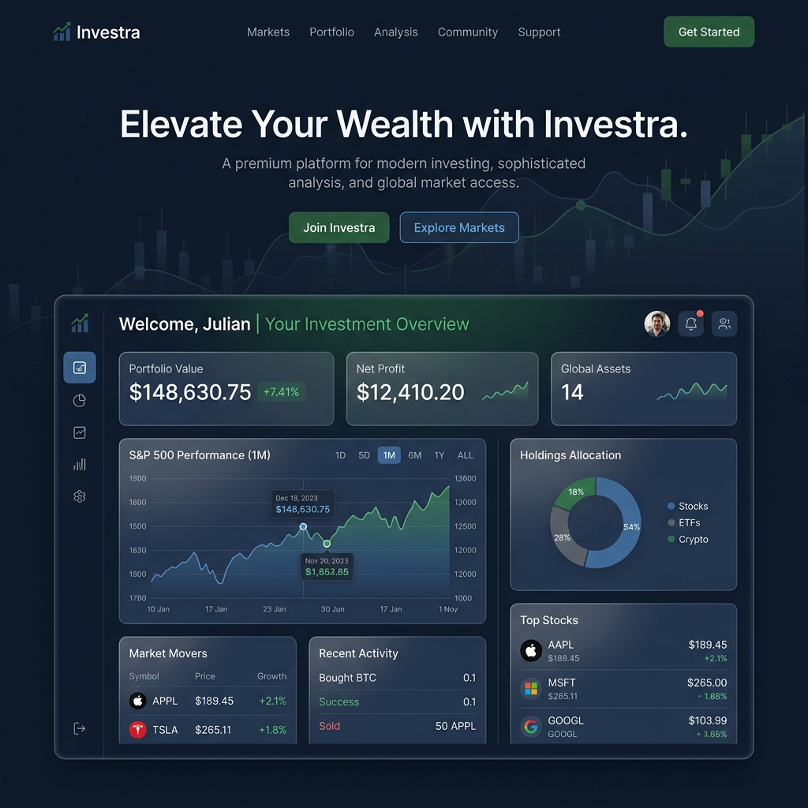

# Investra Brand Identity & Visual Design Guidelines

This document establishes the official visual identity and brand design guidelines for **Investra**—a premium platform connecting Investors, Venture Capitalists, and Elite Entrepreneurs.

---

## 🎨 1. Brand Identity & Visual Preview

Below is the design system preview for **Investra**, demonstrating the official logo layout and dashboard preview showcasing how the new brand color palette combines in a dark-mode dashboard.

### A. Brand Logo Concept
- The letter **I** is fused with a growing financial line chart and an upward-pointing arrow.
- Flowing with the new steel blue, midnight navy, and forest green accents, symbolizing premium quality and corporate growth.


### B. UI Section Overview
- Demonstrating the core layouts of the dark-themed dashboard, detailing card components, active/inactive states, borders, and graphs.



---

## 🎨 2. The Color Palette: "Venture Navy & Forest Growth"

Our four-color design system is engineered for a premium corporate aesthetic, balancing high-trust blues with growth-focused green.

### 🌑 A. Primary Backgrounds & Canvas (Midnight Navy & Steel Blue)
*   **Midnight Navy (Core Dark BG):** `#182B45` | `hsl(215, 49%, 18%)`
    *   *Represents: Security, institutional trust, and structural stability.*
*   **Steel Blue (Primary/Active Brand Accent):** `#263F6A` | `hsl(218, 47%, 28%)`
    *   *Represents: Premium status, active interfaces, focus borders, and interactive states.*

### ❇️ B. Brand Signatures & Accents (Forest Green & Slate Gray)
*   **Forest Green (Growth & Yields):** `#193725` | `hsl(144, 38%, 16%)`
    *   *Represents: Venture capital yields, wealth growth, positive analytics, and success metrics.*
*   **Slate Gray (Muted & Structural Utility):** `#606061` | `hsl(240, 1%, 38%)`
    *   *Represents: Borders (with low opacity), secondary text, placeholders, and inactive states.*

---

## ✍️ 3. Typography (Modern & Authoritative)

Investra's typography balances a modern tech-startup aesthetic with corporate reliability:

*   **Primary Headings (`h1`, `h2`, `h3`):** **Outfit** (Google Fonts) - Clean, round geometric letterforms.
*   **Body & UI Text:** **Plus Jakarta Sans** (Google Fonts) - highly legible at smaller dashboard sizes.

---

## 💎 4. Visual Language & UI Components

### A. Glassmorphism (Card UI)
For dashboards and profiles, use semi-transparent surfaces with a strong blur filter to create depth over the Midnight Navy background:
```css
.glass-panel {
  background: rgba(38, 63, 106, 0.15);
  backdrop-filter: blur(16px);
  border: 1px solid rgba(96, 96, 97, 0.2);
}
```

### B. Micro-Animations & Hover States
Use smooth, tactile transitions. Avoid linear movements; use a premium `cubic-bezier`:
```css
.interactive-element {
  transition: all 0.4s cubic-bezier(0.16, 1, 0.3, 1);
}
.interactive-element:hover {
  transform: translateY(-2px);
  box-shadow: 0 12px 30px -10px rgba(24, 43, 69, 0.5);
  border-color: rgba(96, 96, 97, 0.4);
}
```

---

## ⚙️ 5. Tailwind CSS Configuration Setup (`globals.css`)

Copy this code into your CSS stylesheet (Tailwind v4) to apply these colors globally:

```css
@theme {
  --color-brand-navy: #182b45;
  --color-brand-blue: #263f6a;
  --color-brand-green: #193725;
  --color-brand-gray: #606061;
}
```
