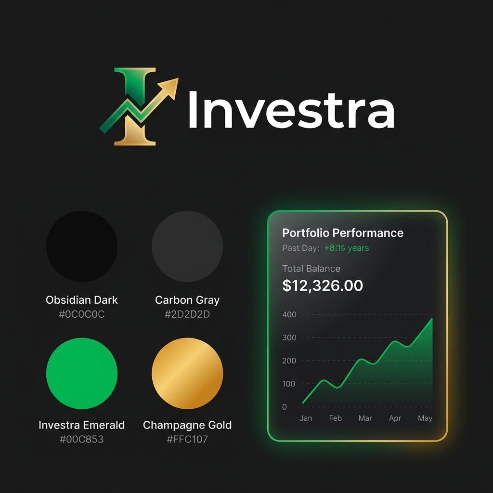

# Investra Brand Identity & Visual Design Guidelines

This document establishes the official visual identity and brand design guidelines for **Investra**—a premium platform connecting Investors, Entrepreneurs, and Consultants. 

---

## 🎨 1. Brand Identity & Visual Preview

Below is the design system preview for **Investra**, including the official application logo concept, the primary color palette swatches with HEX values, and a live rendering of a UI card showing how these colors combine on a dark-mode dashboard.



### Logo Design Intent
- The letter **I** is fused with a growing line chart and an upward-pointing arrow.
- The gradient flows from **Investra Emerald** to **Champagne Gold**, symbolizing the journey from launching an idea (green) to realizing maximum value (gold).

---

## 🎨 2. The Color Palette: "Emerald Wealth & Deep Obsidian"

### 🌑 A. Primary Backgrounds & Neutrals (Obsidian & Platinum)
*   **Obsidian Dark (Deepest dark mode bg):** `#0C0C0C` | `hsl(220, 20%, 4%)`
*   **Carbon Gray (Card & surface bg):** `#2D2D2D` | `hsl(220, 18%, 9%)`
*   **Platinum Light (Text & light mode bg):** `#F8FAFC` | `hsl(210, 40%, 98%)`
*   **Muted Slate (Subtitles & borders):** `#64748B` | `hsl(215, 16%, 47%)`

### ❇️ B. Brand Signatures (Emerald & Gold Accent)
*   **Investra Emerald (Primary/Growth/Success):** `#00C853` | `hsl(161, 94%, 30%)`
    *   *Represents: Wealth, investment, green-lit opportunities, stable growth.*
*   **Champagne Gold (Accent/Premium Status/Highlights):** `#FFC107` | `hsl(35, 92%, 44%)`
    *   *Represents: High quality, premium tier, valuable connections, prestige.*
*   **Electric Teal (Interactivity/Hover states):** `#10B981` | `hsl(162, 76%, 41%)`

---

## ✍️ 3. Typography (Modern & Authoritative)

Investra's typography balances a modern tech-startup aesthetic with corporate reliability:

*   **Primary Headings (`h1`, `h2`, `h3`):** **Outfit** or **Plus Jakarta Sans** (Google Fonts)
*   **Body & UI Text:** **Inter** or **Satoshi**

---

## 💎 4. Visual Language & UI Components

### A. Glassmorphism (Card UI)
For dashboards and profiles, use semi-transparent surfaces with a strong blur filter to create depth:
```css
.premium-card {
  background: rgba(45, 45, 45, 0.7);
  backdrop-filter: blur(12px);
  border: 1px solid rgba(255, 255, 255, 0.05);
  border-radius: 16px;
}
```

### B. Micro-Animations & Hover States
Use smooth, tactile transitions. Avoid linear movements; use a premium `cubic-bezier`:
```css
.interactive-element {
  transition: all 0.3s cubic-bezier(0.16, 1, 0.3, 1);
}
.interactive-element:hover {
  transform: translateY(-2px);
  box-shadow: 0 12px 20px -8px rgba(0, 200, 83, 0.3);
}
```

### C. Spacing & Borders
*   **Border Radii:** Card containers must use `12px` or `16px`. Buttons use pill shape (`9999px`) or `8px` for crisp actions.
*   **Inner Gradients:** Subtly overlay borders with a linear gradient of Emerald to Gold at 15% opacity to make elements pop.

---

## ⚙️ 5. CSS Variable Setup (`globals.css`)

Copy this code into your CSS stylesheet to apply these values globally:

```css
@layer base {
  :root {
    --background: 210 40% 98%;
    --foreground: 222.2 47.5% 11.2%;
    
    --card: 0 0% 100%;
    --card-foreground: 222.2 47.5% 11.2%;
    
    --primary: 161 94% 30%;
    --primary-foreground: 210 40% 98%;
    
    --secondary: 35 92% 44%;
    --secondary-foreground: 222.2 47.5% 11.2%;
    
    --muted: 210 40% 96.1%;
    --muted-foreground: 215.4 16.3% 46.9%;
    
    --accent: 162 76% 41%;
    --accent-foreground: 222.2 47.5% 11.2%;
    
    --border: 214.3 31.8% 91.4%;
    --radius: 12px;
  }

  .dark {
    --background: 220 20% 4%;
    --foreground: 210 40% 98%;
    
    --card: 220 18% 9%;
    --card-foreground: 210 40% 98%;
    
    --primary: 161 94% 30%;
    --primary-foreground: 210 40% 98%;
    
    --secondary: 35 92% 44%;
    --secondary-foreground: 210 40% 98%;
    
    --muted: 217.2 32.6% 17.5%;
    --muted-foreground: 215 16% 47%;
    
    --border: 217.2 32.6% 17.5%;
  }
}
```
